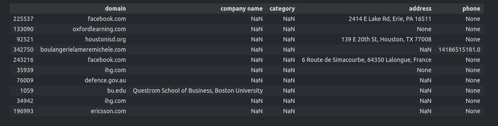

<h1> Datasets Join (Deeptech Engineer Intern Challenge) - ML Python Project</h1>
 
<h2>Features</h2>
<ul>
    <li>containing 3 datasets with data about the same companies from 3 different sources</li>
    <li>Facebook (facebook dataset.csv)</li>
    <li>Google (google dataset.csv)</li>
    <li>Company Website (website dataset.csv)</li>
    <li>The final purpose of this exercise is to create a 4th dataset that contains the other 3 and, by joining them, we should reach a better accuracy on common columns</li>
    <li>The columns that interest us the most are Category, Address (country, region...), Phone, Company names</li>
</ul>

<h2>Acknowledgments</h2>

<b> Python3: http://bit.ly/python3-certifications </b>
 

<h2>Photo</h2>

 
<h2>Contact</h2>

<b> Email: mariusc0023@gmail.com </b>
